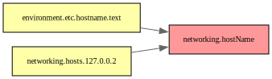

> [!WARNING]
> This repository contains vibecoded content.
> Treat the patches and surrounding packaging as experimental, review everything carefully, and do not assume correctness.

# nixos-config-diff

## Attribution

This repository builds on work by [oddlama](https://github.com/oddlama).
The underlying idea and original implementation come from oddlama's work.

Relevant upstream context:

- Discourse announcement: <https://discourse.nixos.org/t/diffing-nixos-configurations-at-the-config-level/75554>
- Blog post: <https://oddlama.org/blog/tracking-options-in-nixos/>
- Diffing tool: <https://github.com/oddlama/nixos-config-tui>
- Patched `nix` branch: <https://github.com/oddlama/nix/tree/thunk-origins-v1>
- Patched `nixpkgs` branch: <https://github.com/oddlama/nixpkgs/tree/thunk-origins-v1>


This repository packages local copies of the Nix evaluator patches used for configuration-level NixOS diffing.

The patches in [`patches/`](./patches) are derived from oddlama's work on tracking NixOS option values and dependencies, and are exposed here as a small flake that builds patched `nix` CLI packages for Nix `2.33` and `2.34`.

## Packages

This flake provides:

- `.#nix_2_33`
- `.#nix_2_34`
- `.#default` (`nix_2_34`)

Build one with:

```bash
nix build .#nix_2_34
```

## Diff SVG

Generate an SVG dependency graph showing which options changed between two toplevels:

```bash
nix run .#diff-svg -- /nix/var/nix/profiles/system-42-link /nix/var/nix/profiles/system-43-link > diff.svg
```

Both toplevels must have been built with `trackDependencies = true`.

### Example

The `e2e-changed` configuration adds `networking.hostName = "tracked-test"` on top of `e2e-base`:



- Red: user-changed options
- Yellow: options that depend on the changed options

## Dependency Tracking

The `nixosConfigurations` (`e2e-base`, `e2e-changed`) have `trackDependencies = true` and expose a `dependencyTracking` attribute with the following fields:

- `counts` — summary statistics
- `configValues` / `explicitConfigValues` — all or explicitly set config values
- `leafNodes` / `explicitLeafNodes` — leaf nodes in the dependency graph
- `keptNodes` — nodes retained after filtering
- `rawDeps` / `filteredDeps` — raw and filtered dependency edges
- `rawDotOutput` / `filteredDotOutput` — Graphviz DOT output

Access them using the patched nix:

```bash
nix run .#nix_2_34 -- eval .#nixosConfigurations.e2e-base.dependencyTracking.counts
nix run .#nix_2_34 -- eval .#nixosConfigurations.e2e-base.dependencyTracking.configValues --json
nix run .#nix_2_34 -- eval .#nixosConfigurations.e2e-base.dependencyTracking.filteredDotOutput --raw > deps.dot
nix run .#nix_2_34 -- build .#nixosConfigurations.e2e-base.config.system.build.toplevel
```

Or explore interactively:

```bash
nix run .#nix_2_34 -- repl .#nixosConfigurations.e2e-base
```

## E2E Check

Run the end-to-end diff check with:

```bash
nix run .#e2e-check
```
